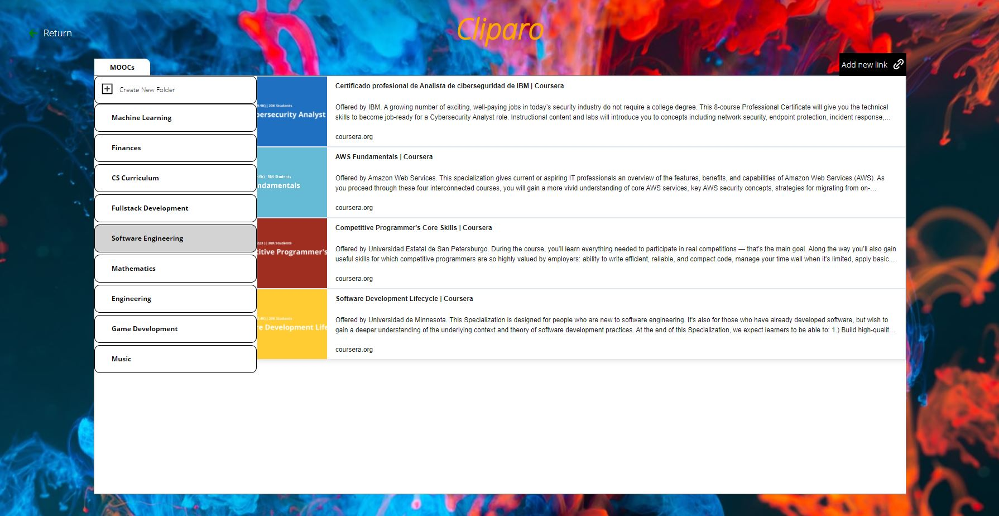

# Cliparo
## A web APP to store web links into folders for future reference

### Author: Mariano L. Acosta

This project was created using the MERN stack (Mongodb, Express, React.js and Node.js)

## Instalation

Only the development version is available. In order to try this project on your own, you need to install mongodb on your local computer: https://docs.mongodb.com/manual/installation/

 First clone the repository, then install the dependencies:

`npm install`

You need to run the express server first:

`node server.js`

After that you are ready to use the application:

`npm run start`

# Usage

